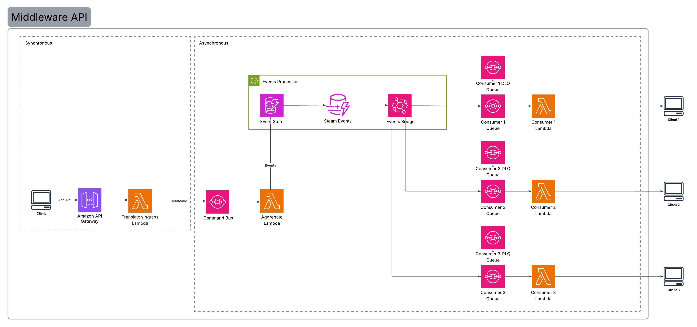

# Middleware Event Sourcing

This project is a minimal event-sourcing middleware built on AWS. It exposes an HTTP API that accepts order commands, translates payloads from external ingress formats, and stores domain events in DynamoDB. A DynamoDB stream is connected to EventBridge via a Pipe, and events are fan-out to downstream SQS queues for consumers.

## Architecture Overview

1. API Gateway accepts `POST /orders`.
2. A translation Lambda validates and adapts incoming payloads into a `CreateOrder` command.
3. The command is sent to SQS for asynchronous processing.
4. A handler Lambda consumes commands and writes `OrderCreated` events into the event store (DynamoDB).
5. DynamoDB Stream feeds EventBridge; rules route events to per-consumer SQS queues.
